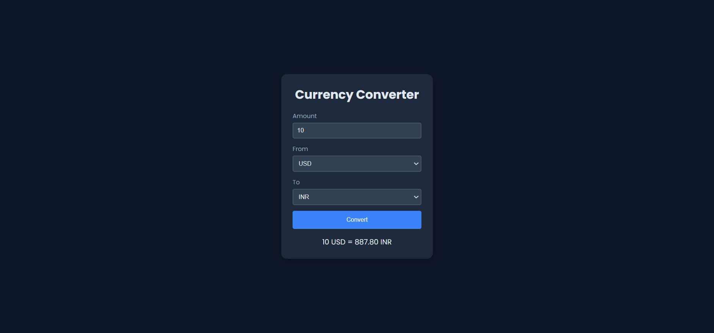
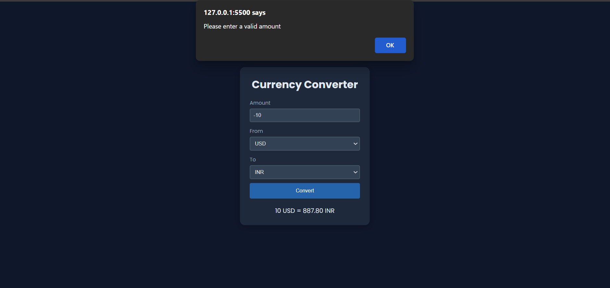

# 💱 Currency Converter

🌍 *“Switch between world currencies in seconds — with accuracy and elegance.”*

An interactive and user-friendly **Currency Converter** built using **HTML**, **CSS**, and **JavaScript**.  
It allows users to convert any currency into another in real time, with built-in input validation and a simple design.

---

## 📖 Description
This project lets users easily convert between currencies using real-time exchange rates.  
The default currency is **USD**, but users can switch to any currency across the world.  
It includes validation to prevent invalid conversions (like empty or negative amounts) and provides clear feedback.

---

## 🚀 Features
- 🌍 Convert between multiple global currencies  
- 💲 USD set as default currency  
- ⚠️ Alerts for invalid input (empty or negative values)  
- 🎨 Modern UI using CSS `:root` variables for easy color and theme control  
- ⚡ Fast and responsive design  

---

## ▶️ How to Use
1. Enter the amount you want to convert.  
2. Select the *from* and *to* currencies.  
3. Click **Convert** to see the result instantly.  
4. If the amount field is empty or negative, an alert message will appear asking for a valid input.

---

## 🛠️ Technologies Used
- **HTML** – Page structure  
- **CSS** – Styling and responsive layout  
- **JavaScript** – Logic and interactivity  

---

## 📸 Preview

  

  

